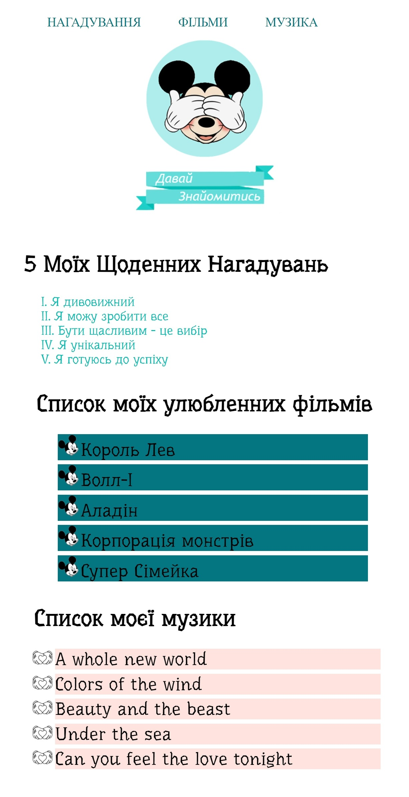

# Заняття 10

### Псевдокласи

Псевдокласи в CSS - це спеціальні ключові слова, які додаються до селекторів для специфічного стилювання елементів на основі їх стану чи позиції у документі. Вони значно розширюють можливості CSS, дозволяючи створювати більш динамічні стилі.

#### Псевдокласи дії

1. **`:hover`**
   - Застосовується, коли користувач наводить курсор миші на елемент.
   - Приклад:
     ```css
     a:hover {
       color: red;
     }
     ```

2. **`:active`**
   - Застосовується до елементу в момент натискання на нього.
   - Приклад:
     ```css
     a:active {
       color: green;
     }
     ```

3. **`:focus`**
   - Застосовується до елемента, коли він активований або отримує фокус.
   - Приклад:
     ```css
     input:focus {
       border: 2px solid blue;
     }
     ```

### Псевдокласи стану

1. **`:checked`**
   - Застосовується до елементів `input` типу `checkbox` або `radio`, коли вони відмічені.
   - Приклад:
     ```css
     input:checked {
       background-color: yellow;
     }
     ```

2. **`:disabled`**
   - Застосовується до елементів `input`, коли вони недоступні для взаємодії.
   - Приклад:
     ```css
     input:disabled {
       background-color: lightgray;
     }
     ```

### Псевдокласи позиції

1. **`:first-child`**
   - Застосовується до першого елемента у батьківському контейнері.
   - Приклад:
     ```css
     p:first-child {
       font-weight: bold;
     }
     ```

2. **`:last-child`**
   - Застосовується до останнього елемента у батьківському контейнері.
   - Приклад:
     ```css
     p:last-child {
       font-style: italic;
     }
     ```

## Завдання 1

Оформити сторінку так як показано на зображені


