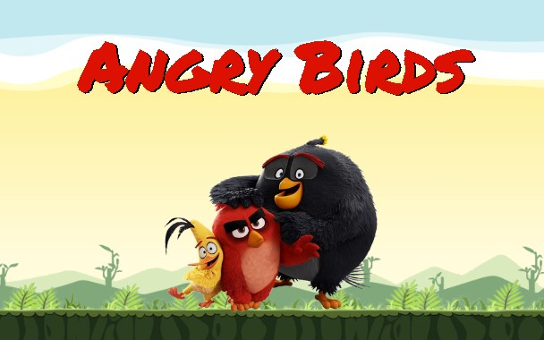

# Заняття 12

### Багатошаровий фон у CSS

**Багатошаровий фон** у CSS дозволяє накладати кілька фонів (кольори, зображення, градієнти) один на одного для створення складних і цікавих дизайнів. CSS дозволяє легко налаштовувати багатошаровий фон за допомогою властивостей `background` або `background-image`, `background-position`, `background-repeat`, `background-size`, та ін.

### Основні властивості багатошарового фону

#### 1. Властивість `background-image`
`background-image` дозволяє задавати кілька зображень фону, розділених комою.

```css
body {
    background-image: url('image1.png'), url('image2.png');
}
```

#### 2. Властивість `background-position`
`background-position` використовується для налаштування позиції кожного фону. Задається у відповідному порядку для кожного зображення фону.

```css
body {
    background-image: url('image1.png'), url('image2.png');
    background-position: top left, bottom right;
}
```

#### 3. Властивість `background-size`
`background-size` задає розмір кожного фонового зображення.

```css
body {
    background-image: url('image1.png'), url('image2.png');
    background-position: top left, bottom right;    
    background-size: cover, 50px 50px;
}
```

#### 5. Комплексна властивість `background`
Властивість `background` дозволяє одночасно задавати всі властивості фонів.

```css
body {
    background: url('image1.png') top left no-repeat, url('image2.png') bottom right repeat;
}
```

### Завдіння 1

1. Відкрити файл index.html в піпці task1.

2. За допомогою css оформити сторінку так як на зображені нижче.



### Kahoot

[](https://kahoot.it/)
