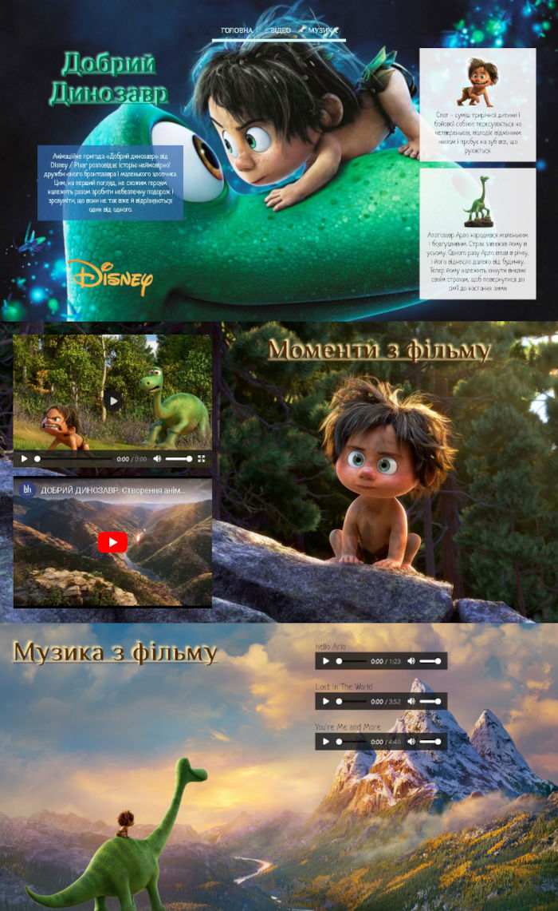

# Заняття 17

## Відео та аудіо в HTML

HTML5 має теги для вбудовування мультимедійних елементів, таких як відео та аудіо. Давайте розглянемо основні теги та атрибути, які використовуються для роботи з відео та аудіо в HTML.

### Відео в HTML

Для вбудовування відео використовується тег `<video>`. Цей тег дозволяє відтворювати відеофайли без потреби в додаткових плагінах. Ось основна структура тега `<video>`:

```html
<video width="600" height="400" controls>
  <source src="video.mp4" type="video/mp4">
  <source src="video.ogg" type="video/ogg">
  Ваш браузер не підтримує відео.
</video>
```

#### Атрибути тега `<video>`:
- **`src`**: Посилання на відеофайл.
- **`controls`**: Додає елементи керування (відтворення, пауза, регулювання гучності тощо).
- **`width`** і **`height`**: Задають розміри відео.
- **`autoplay`**: Автоматичне відтворення відео після завантаження сторінки.
- **`loop`**: Повторне відтворення відео після завершення.
- **`muted`**: Вимкнення звуку у відео.

### Аудіо в HTML

Для вбудовування аудіо використовується тег `<audio>`. Подібно до відео, цей тег дозволяє відтворювати аудіофайли без додаткових плагінів. Ось основна структура тега `<audio>`:

```html
<audio controls>
  <source src="audio.mp3" type="audio/mp3">
  <source src="audio.ogg" type="audio/ogg">
  Ваш браузер не підтримує аудіо.
</audio>
```

#### Атрибути тега `<audio>`:
- **`src`**: Посилання на аудіофайл.
- **`controls`**: Додає елементи керування (відтворення, пауза, регулювання гучності тощо).
- **`autoplay`**: Автоматичне відтворення аудіо після завантаження сторінки.
- **`loop`**: Повторне відтворення аудіо після завершення.
- **`muted`**: Вимкнення звуку у аудіо.

### Вбудовування мультимедіа з декількома форматами

Оскільки не всі браузери підтримують усі формати відео та аудіо, рекомендується використовувати кілька джерел у різних форматах. Наприклад:

```html
<video width="600" height="400" controls>
  <source src="video.mp4" type="video/mp4">
  <source src="video.webm" type="video/webm">
  <source src="video.ogg" type="video/ogg">
  Ваш браузер не підтримує відео.
</video>

<audio controls>
  <source src="audio.mp3" type="audio/mp3">
  <source src="audio.ogg" type="audio/ogg">
  Ваш браузер не підтримує аудіо.
</audio>
```

### Резюме

Теги `<video>` і `<audio>` в HTML5 значно полегшують вбудовування мультимедійних елементів на веб-сторінки. Використовуючи їх з відповідними атрибутами та декількома форматами файлів, ви можете забезпечити сумісність з більшістю браузерів і створити якісний досвід для користувачів.


### Завдання 1

1. Відкрити файл index.html в піпці task.

2. За допомогою css оформити сторінку так як на зображені нижче.


