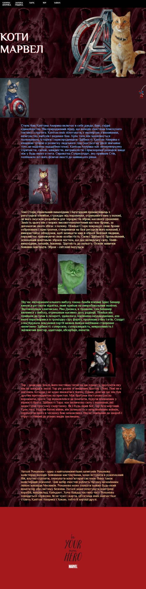

# Заняття 17

## Позиціонування

Властивість `position` в CSS дозволяє контролювати розташування елементів на веб-сторінці. Вона визначає, як елемент буде позиціонуватися відносно інших елементів або вікна браузера. Існує п'ять основних значень для властивості `position`:

1. **`static`** (за замовчуванням)
2. **`relative`**
3. **`absolute`**
4. **`fixed`**
5. **`sticky`**

Розглянемо кожне з них детальніше.


### 1. `position: static;`
- **Опис**: Це значення за замовчуванням. Елементи з `position: static` розташовуються в нормальному потоці документа. Властивості `top`, `right`, `bottom`, `left` та `z-index` не впливають на елементи з таким позиціонуванням.
- **Приклад**:
  ```css
  div {
      position: static;
  }
  ```


### 2. `position: relative;`
- **Опис**: Елемент позиціонується відносно свого нормального положення в потоці документа. Ви можете зміщувати елемент за допомогою властивостей `top`, `right`, `bottom`, `left`. Інші елементи на сторінці не змінюють свого положення, навіть якщо цей елемент зміщений.
- **Приклад**:
  ```css
  div {
      position: relative;
      top: 20px;
      left: 30px;
  }
  ```
  У цьому прикладі елемент зміститься на 20px вниз і 30px вправо від свого початкового положення.


### 3. `position: absolute;`
- **Опис**: Елемент видаляється з нормального потоку документа і позиціонується відносно найближчого предка з позиціонуванням, відмінним від `static` (наприклад, `relative`, `absolute`, `fixed`, `sticky`). Якщо такого предка немає, елемент позиціонується відносно вікна браузера.
- **Приклад**:
  ```css
  .container {
      position: relative;
  }
  .box {
      position: absolute;
      top: 10px;
      right: 10px;
  }
  ```
  У цьому прикладі елемент `.box` буде розташований на 10px від верхнього та правого краю елемента `.container`.


### 4. `position: fixed;`
- **Опис**: Елемент фіксується відносно вікна браузера. Навіть при прокручуванні сторінки елемент залишається на тому самому місці. Часто використовується для створення фіксованих заголовків, меню або кнопок.
- **Приклад**:
  ```css
  nav {
      position: fixed;
      top: 0;
      left: 0;
      width: 100%;
      background-color: #333;
      color: white;
  }
  ```
  У цьому прикладі навігаційна панель залишатиметься вгорі сторінки навіть під час прокручування.


### 5. `position: sticky;`
- **Опис**: Гібрид між `relative` та `fixed`. Елемент поводиться як `relative`, доки не досягне певної точки прокручування, після чого він "прилипає" до заданого положення. Часто використовується для заголовків таблиць або секцій.
- **Приклад**:
  ```css
  header {
      position: sticky;
      top: 0;
      background-color: #f1f1f1;
  }
  ```
  У цьому прикладі заголовок буде прилипати до верхнього краю вікна браузера, коли користувач прокручує сторінку.


### Властивості для позиціонування:
- **`top`**, **`right`**, **`bottom`**, **`left`**: Визначають зміщення елемента відповідно до верхнього, правого, нижнього або лівого краю.
- **`z-index`**: Визначає порядок накладання елементів. Елементи з більшим значенням `z-index` відображаються поверх елементів з меншим значенням.

---

## Завдання 1

1. Відкрийте файли index.html та style.css з папки task1


